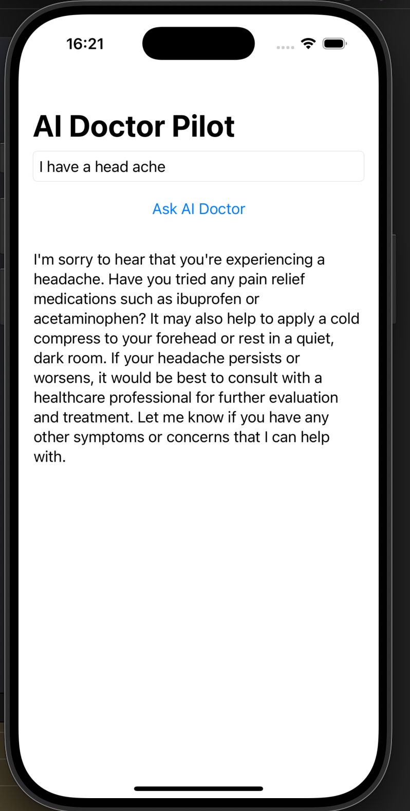

# 🩺 AI Doctor Pilot

A full-stack iOS application that simulates a virtual medical assistant using a locally hosted AI model. Built with **SwiftUI (frontend)** and **Node.js (backend)**, it connects to **Ollama** for offline LLM completions.

> No API keys. No cloud dependencies. Just local AI.

---

## ⚙️ Stack

| Layer       | Tech                      |
|-------------|---------------------------|
| iOS App     | SwiftUI                   |
| Backend     | Node.js + Express         |
| AI Model    | Locally hosted via [Ollama](https://ollama.com) |
| Model Used  | `deepseek-r1:1.5b` (or any you prefer) |

---

## 📱 App Preview

---

## 🧠 How It Works

1. User inputs a health-related question in the iOS app.
2. The app sends it to the local Node.js server via a `/ask` POST request.
3. The server builds a prompt and forwards it to a local Ollama model.
4. The model generates a response, which is returned to the app.

---

## 🚀 Getting Started

### 1. Clone the Repo

git clone https://github.com/MaximilianPaterno/ai-doctor.git  
cd ai-doctor

---

### 2. Backend Setup

cd backend/ai-doctor-server  
npm install  
ollama pull deepseek-r1:1.5b  
node server.js

> Server runs at: http://127.0.0.1:3000

---

### 3. Frontend Setup

Open the SwiftUI project in Xcode:

frontend/AIDoctorPilot.xcodeproj

Make sure your ContentView.swift is pointing to your local server IP.

Then build & run the app in the iOS simulator or on your iPhone.

---

## 🛑 Disclaimer

This app is a **prototype** and should not be used for real medical advice. Always consult a licensed healthcare professional.

---

## 🧑‍💻 Author

**Maximilian Paterno**  
https://github.com/MaximilianPaterno

---

## 🪪 License

MIT
